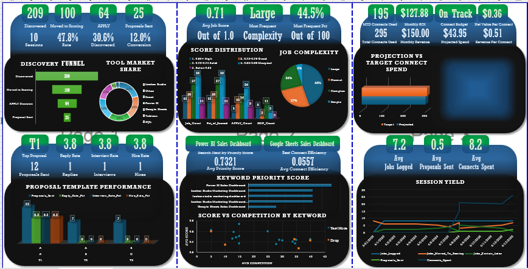
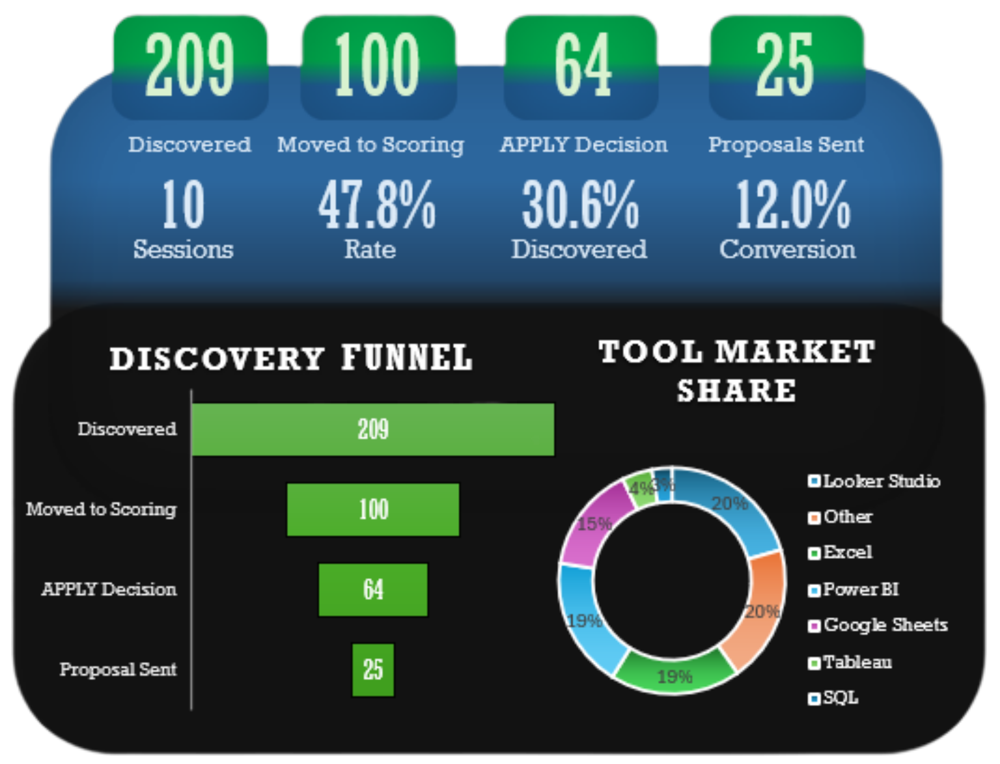
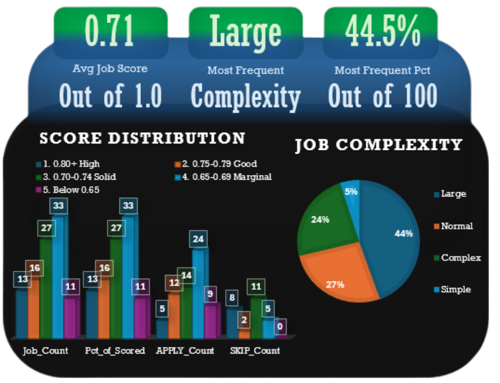
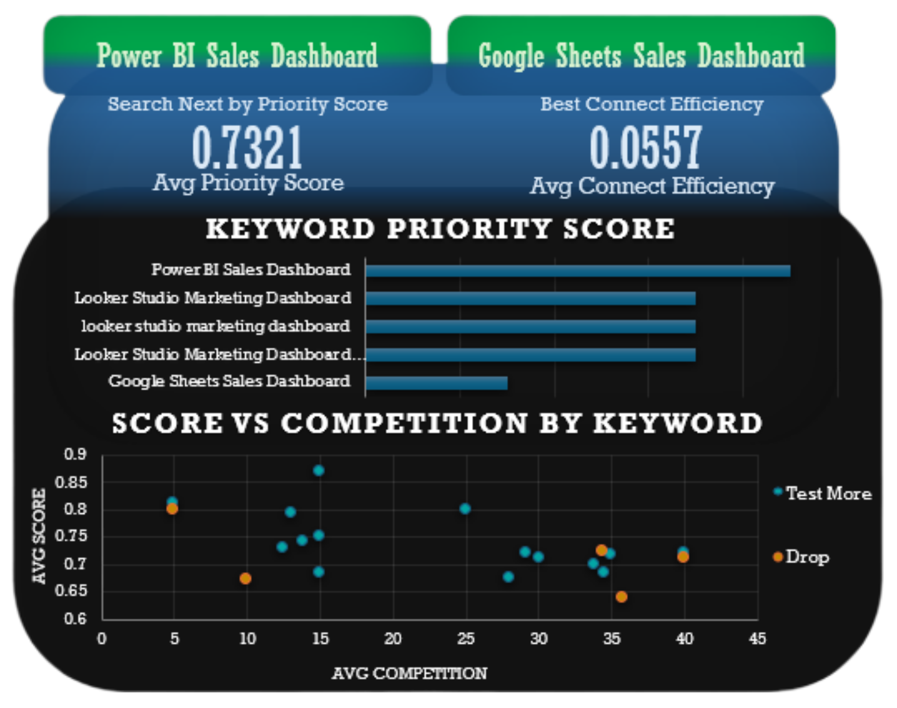
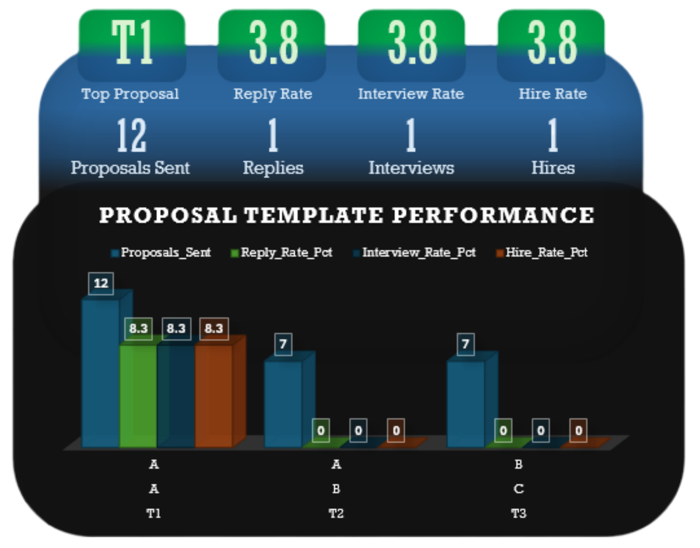
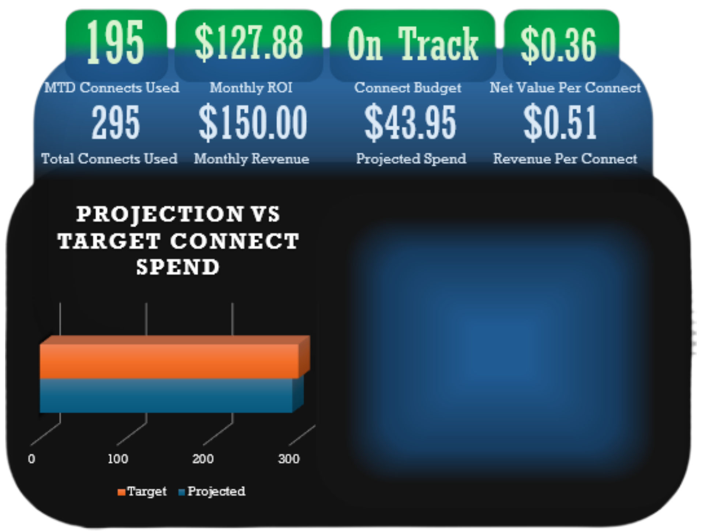
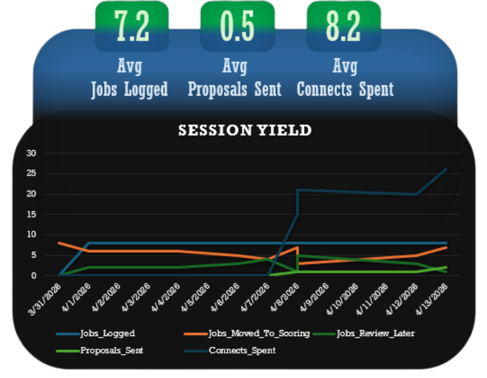

# 📋 Upwork Acquisition Analytics Dashboard

**Multi-section Excel analytics dashboard visualizing a freelance client acquisition pipeline built on BigQuery SQL exports.**

---

## 📌 Project Overview

Built a portfolio Excel dashboard for Benchline Analytics that visualizes the full Upwork client acquisition pipeline. The dashboard connects 8 BigQuery SQL query exports across 6 data tabs, powering KPI tiles, charts, and performance tables that update as new data is exported from BigQuery.

<!-- ===================== -->
<!--        PREVIEW        -->
<!-- ===================== -->


**Pipeline flow:**
BigQuery SQL exports → CSV → Excel data tabs → Dashboard visualizations

[Upwork Acquisition Dashboard](https://github.com/visualkirby/Upwork-Acquisition-Dashboard/blob/main/UpWork_Acquisition_Dashboard.xlsx)

---

## 📊 Dashboard Sections

### Acquisition Funnel
Discovery funnel horizontal bar chart, tool market share donut chart, and score distribution stacked bar chart.

<!-- ===================== -->
<!--        PREVIEW        -->
<!-- ===================== -->


### Job Quality
Job complexity breakdown by category (Large, Normal, Complex, Simple) with percentage distribution.

<!-- ===================== -->
<!--        PREVIEW        -->
<!-- ===================== -->


### Keyword Performance
Keyword Priority Score horizontal bar chart showing top keywords by score. Score vs Competition scatter plot with Test More vs Drop status color coding.

<!-- ===================== -->
<!--        PREVIEW        -->
<!-- ===================== -->


### Proposal Performance
Proposal Template Performance grouped bar chart showing reply rate, interview rate, and hire rate by template and hook/CTA version combination.

<!-- ===================== -->
<!--        PREVIEW        -->
<!-- ===================== -->


### Connect Efficiency
4 KPI tiles covering MTD connects used, projected month-end cost, on-track flag, and net value per connect. Projection vs Target connect spend progress bar chart. Placeholder reserved for monthly trend line chart after first month-end snapshot.

<!-- ===================== -->
<!--        PREVIEW        -->
<!-- ===================== -->


### Session Performance
3 session KPI tiles (avg jobs logged, avg proposals sent, avg connects spent). Session Yield multi-line chart tracking jobs logged, moved to scoring, proposals sent, and connects spent across all sessions.

<!-- ===================== -->
<!--        PREVIEW        -->
<!-- ===================== -->


---

## 🔑 Key Metrics (April 2026)

| Metric | Value |
|--------|-------|
| Jobs Discovered | 209 |
| Proposals Sent | 26 |
| Avg Job Score | 0.71 |
| Reply Rate | 3.8% |
| Top Keyword (Priority) | Power BI Sales Dashboard |
| Best Connect Efficiency | Google Sheets Revenue Dashboard |
| MTD Connects Used | 195 |
| Projected Month End Cost | $43.95 |
| Net Value per Connect | $0.36 |

---

## 🔄 Refresh Architecture

Dashboard connects to live data via Power Query:

- All 8 data tabs connect to BigQuery query results via Connected Sheets
- Configured to refresh on file open and every 60 minutes while open
- Data → Refresh All triggers all connections simultaneously
- No manual CSV exports or copy-paste required

Pipeline: Google Sheets → BigQuery External Tables → Connected Sheets → Power Query → Excel Dashboard

---

## 🛠️ Tools & Technologies

- **Microsoft Excel** — dashboard visualization and formula layer
- **BigQuery** — upstream SQL analysis (see Pipeline repo)
- **Google Sheets** — source data system

---

## 📁 Repository Structure

```
Upwork-Acquisition-Dashboard/
├── README.md
    ├── Acquisition_Dashboard_Full.png
├── UpWork_Acquisition_Dashboard.xlsx
└── screenshots/
    ├── Acquisition_Funnel.png
    ├── Job_Quality.png
    ├── Keyword_Performance.png
    ├── Proposal_Performance.png
    ├── Connect_Efficiency.png
    └── Session_Performance.png
```

---

## 🔗 Related Project

This dashboard is the visualization layer built on top of the SQL pipeline:
[Upwork Acquisition Pipeline](https://github.com/visualkirby/Upwork-Acquisition-Pipeline)
